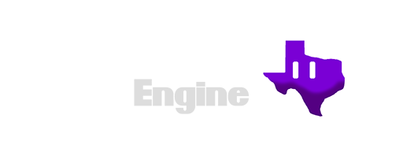
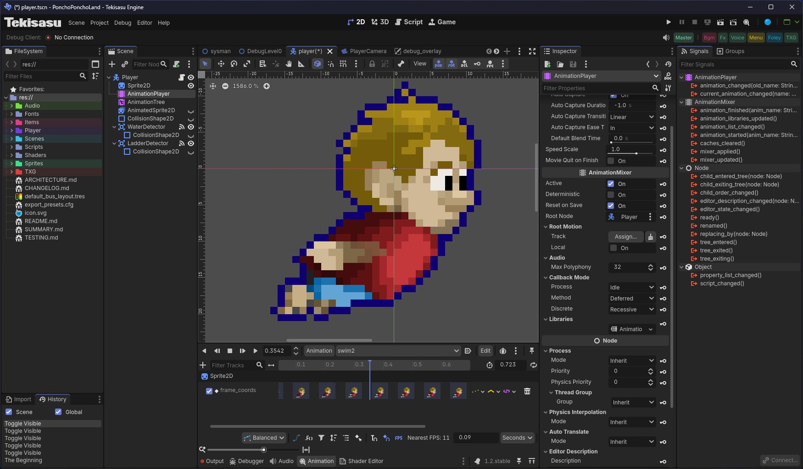

# Tekisasu 

  

  

## Tekisasu Engine

Tekisasu Engine is forked from upstream [Godot Engine](https://godotengine.org).

If you are not part of Tekisasu, please do not use Tekisasu Engine as it likely won't suit your needs.

Instead, if you are interested in using similar software with community participation, please refer to Blazium or Godot.

All source code here, unless otherwise noted, is licensed under MIT/expat and you're free to do with it as you wish.  However, the Tekisasu logo graphics are the property of Tekisasu and have no license available for re-use.

